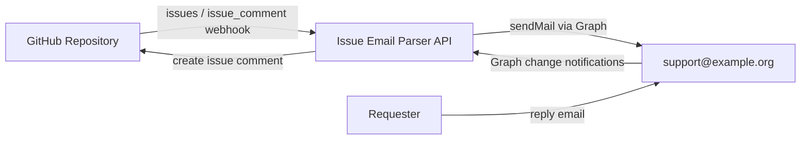

# GitHub Issue Email Parser

Generic email bridge between GitHub Issues and an Exchange Online mailbox (Microsoft Graph).

## Why a dedicated repository

This bridge handles credentials, webhook processing, and integration logic. Keeping it separate from the ticket repository provides:

- Least-privilege access boundaries
- Separate deployment and secret management lifecycle
- Cleaner audit trail for integration changes

## Scope

Implemented in this scaffold:

- GitHub webhook endpoint (`issues`, `issue_comment`)
- Microsoft Graph webhook endpoint for inbox message notifications
- Outbound email notifications from a configurable mailbox
- Reply parsing from inbound email into GitHub issue comments
- Signed issue tokens in email subject for thread mapping
- SQLite idempotency store for processed inbound messages

Not yet implemented:

- Attachment ingestion
- Advanced HTML sanitization and robust MIME parsing
- Rich dead-letter dashboard/metrics export

## Architecture



## Project layout

- `src/helpdesk_bridge/main.py`: FastAPI entrypoint and webhook routes
- `src/helpdesk_bridge/retry_worker.py`: CLI worker for processing retry queue jobs
- `src/helpdesk_bridge/subscription_lifecycle.py`: CLI for Graph subscription status/ensure actions
- `src/helpdesk_bridge/webhooks/github_handler.py`: GitHub webhook verification + outbound email handling
- `src/helpdesk_bridge/webhooks/graph_handler.py`: Graph notification handling + inbound comment creation
- `src/helpdesk_bridge/services/`: token codec, parser, clients, and SQLite store
- `src/helpdesk_bridge/services/retry_processor.py`: queue backoff/dead-letter execution logic
- `src/helpdesk_bridge/services/alerts.py`: alert delivery hooks (webhook/email)
- `src/helpdesk_bridge/services/logging_config.py`: JSON structured logging setup
- `src/helpdesk_bridge/services/subscription_manager.py`: Graph subscription lifecycle management logic
- `tests/`: parser/token tests

## Configuration

Copy `.env.example` to `.env` and set required values.

Required values:

- `BRIDGE_TOKEN_SECRET`
- `GITHUB_TOKEN`
- `GITHUB_WEBHOOK_SECRET`
- `GRAPH_TENANT_ID`
- `GRAPH_CLIENT_ID`
- `GRAPH_CLIENT_SECRET`
- `GRAPH_SUPPORT_MAILBOX` (default `support@example.org`)
- `GRAPH_CLIENT_STATE` (must match Graph subscription `clientState`)
- `GRAPH_NOTIFICATION_URL` (public Graph webhook URL, for example `https://<bridge-host>/webhooks/graph`)

Lifecycle tuning values (recommended to set explicitly in production):

- `GRAPH_SUBSCRIPTION_ID` (optional: pinned subscription id if already created)
- `GRAPH_SUBSCRIPTION_RESOURCE` (default `/users/support@example.org/mailFolders('Inbox')/messages`)
- `GRAPH_SUBSCRIPTION_LIFETIME_MINUTES` (default `2880`)
- `GRAPH_SUBSCRIPTION_RENEWAL_WINDOW_MINUTES` (default `360`)

Reliability and observability values:

- `LOG_LEVEL` (default `INFO`)
- `API_RETRY_MAX_ATTEMPTS` / `API_RETRY_BASE_DELAY_SECONDS` / `API_RETRY_MAX_DELAY_SECONDS`
- `RETRY_QUEUE_MAX_ATTEMPTS` / `RETRY_QUEUE_BASE_DELAY_SECONDS` / `RETRY_QUEUE_MAX_DELAY_SECONDS`
- `RETRY_WORKER_BATCH_SIZE` (default `25`)
- `ALERT_WEBHOOK_URL` (optional JSON POST target)
- `ALERT_EMAIL_TO` (optional mailbox for failure alerts)
- `ALERT_SUBJECT_PREFIX` (default `[Issue Email Parser Alert]`)

## Local run

```bash
python -m venv .venv
source .venv/bin/activate
pip install -e .[dev]
uvicorn helpdesk_bridge.main:app --reload --host 0.0.0.0 --port 8000
```

## Webhook endpoints

- `POST /webhooks/github`
- `GET /webhooks/graph` (Graph validation handshake)
- `POST /webhooks/graph`
- `GET /health`

## Container deployment (Traefik host)

Build image:

```bash
docker build -t issue-email-parser:local .
```

Run with required env vars and persistent data volume:

```bash
docker run -d \
  --name issue-email-parser \
  --restart unless-stopped \
  -p 8000:8000 \
  -v /opt/sites/issue-email-parser/data:/data \
  --env-file /path/to/runtime.env \
  issue-email-parser:local
```

## GitHub setup

1. Configure webhook on your target repository:
   - Payload URL: `<bridge-url>/webhooks/github`
   - Secret: `GITHUB_WEBHOOK_SECRET`
   - Events: `Issues`, `Issue comment`
2. Ensure issue templates include requester contact email in issue body.

## Microsoft Graph / Exchange Online setup

1. Register an Entra application for the bridge.
2. Grant app permissions required for this flow (least privilege in production):
   - `Mail.Send`
   - `Mail.Read`
   - `MailboxSettings.Read` (if needed for mailbox details)
3. Configure Graph webhook subscription on `support@example.org` Inbox messages, pointing to `<bridge-url>/webhooks/graph`.
   - Set subscription `clientState` to the same value as `GRAPH_CLIENT_STATE`.
4. Grant mailbox access permissions for the bridge app to `support@example.org`.

## Graph subscription lifecycle (create/renew/status)

Run from the bridge runtime (container or host venv):

```bash
python -m helpdesk_bridge.subscription_lifecycle --mode status
python -m helpdesk_bridge.subscription_lifecycle --mode ensure
```

- `status` reports subscription health and returns non-zero when missing/expired/renewal_due.
- `ensure` creates a new subscription when missing or renews when within the renewal window.

Suggested monitoring pattern:

- Execute `status` every 15 minutes from cron/systemd timer.
- Alert on non-zero exit.
- Execute `ensure` on a fixed schedule (for example every 6 hours) and after deploy.

Manual fallback:

1. Run `ensure` manually.
2. Re-run `status` and verify `state=healthy`.
3. If lookup ambiguity exists, set `GRAPH_SUBSCRIPTION_ID` to the known active subscription and rerun.

## Retry queue, logging, and alerting

Runtime behavior:

- Graph/GitHub API calls use retry/backoff for transient failures.
- Failed outbound deliveries and inbound comment writes are queued in SQLite retry queue.
- All app logs are emitted as JSON structured records.
- Alerts are emitted to logs and optionally to `ALERT_WEBHOOK_URL` and/or `ALERT_EMAIL_TO`.

Process retry queue manually:

```bash
python -m helpdesk_bridge.retry_worker --limit 25
```

Suggested operations pattern:

- Run retry worker every 5 minutes using cron/systemd timer.
- Alert when retry worker exits non-zero (dead-letter occurred).
- Monitor pending retry count from worker JSON output.

## Security notes

- Store secrets in deployment secret manager, not in Git.
- Use TLS and IP filtering/WAF in front of webhook endpoints.
- Enable alerting for failed webhook deliveries.

## License

Apache-2.0. See `LICENSE`.
